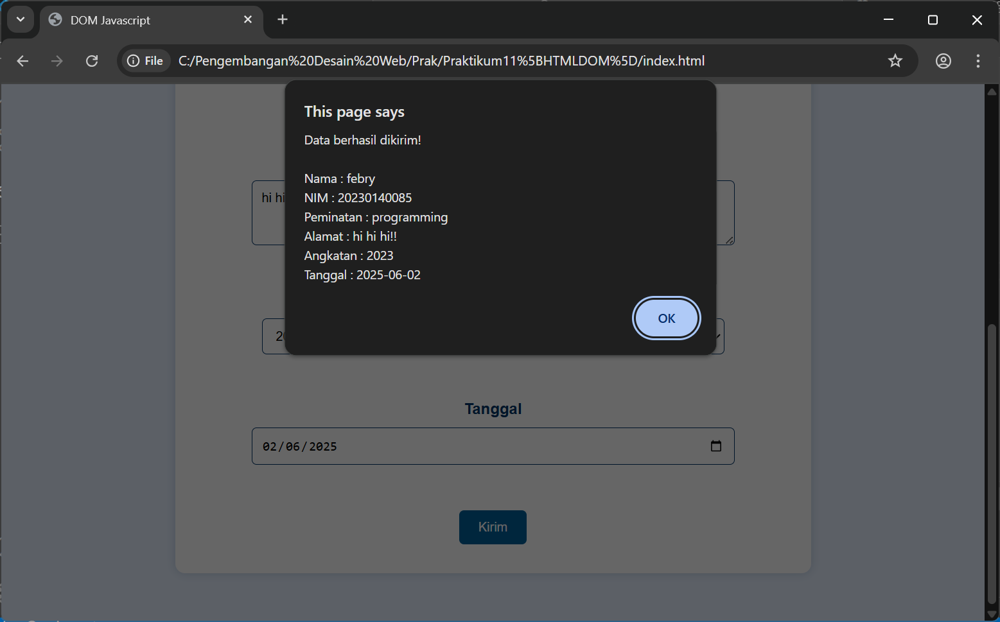

# Praktikum 11 - DOM HTML & JavaScript

## Deskripsi
Proyek ini merupakan bagian dari Praktikum Pemrograman Desain Web (PDW) yang bertujuan untuk melatih kemampuan manipulasi elemen HTML menggunakan JavaScript DOM. Formulir pendaftaran ini memiliki input berupa nama, NIM, pilihan peminatan, angkatan, dan tanggal pendaftaran.

Elemen-elemen yang digunakan:
- Input teks untuk nama dan NIM
- Radio button untuk peminatan
- Dropdown (select) untuk angkatan
- Date picker untuk memilih tanggal
- Tombol untuk mengirim formulir

Semua elemen tersebut dimodifikasi dan dikembangkan berdasarkan instruksi pada Modul 12, dengan menambahkan kreativitas masing-masing mahasiswa.

## Hasil Run Program
Berikut adalah tampilan saat program dijalankan:

## Cara Menjalankan
1. Buka file `index.html` di browser (bisa langsung klik dua kali).
2. Isi formulir sesuai data diri.
3. Klik tombol **Kirim** untuk menyelesaikan pendaftaran.

## Author
Febry40 - 202001400002
